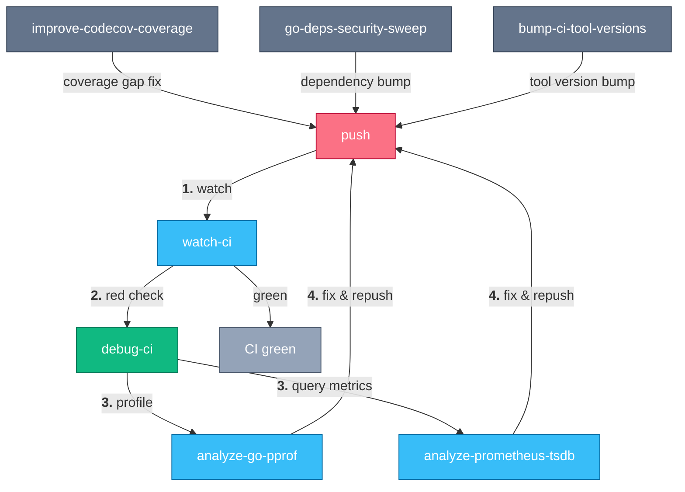

# Go CI Health

> Keep a Go repo’s CI green, fast, and secure.

A red check is the start of a loop, not a dead end.
Something fails, an agent triages it to a root cause instead of guessing, and a fix goes out — then the agent watches the pushed fix to terminal state instead of you babysitting a `gh pr checks` loop.
When the failure isn't obvious from logs alone, the same loop reaches for the CI-captured pprof and Prometheus artifacts to tell a real leak or regression apart from noise.
Feeding that same loop are three standing maintenance passes: closing coverage gaps Codecov flags, running a grouped and bisectable dependency security sweep, and keeping the pinned tool versions in CI workflows fresh.
Each of those maintenance passes produces its own commits and pushes — which is where the triage-and-watch loop picks them back up.

## How it works



Every push — whether from a hotfix or one of the three maintenance passes — goes through the same watch loop.
A red check hands off to root-cause triage, which reaches for pprof or Prometheus artifacts when the logs alone don't explain it, and any fix goes back through the same loop until the check is green.

## A week with it

Each step is the literal phrase you say to your agent (Claude Code, pi, or any harness that reads skills):

1. **"why is this failing in CI?"** — separate a real regression from pre-existing noise and get to the failing line with the cheapest log fetch first (`debug-ci`).
2. **"watch CI"** — after pushing a fix, watch the checks to terminal state and get notified the moment one goes green or red, instead of busy-polling (`watch-ci`).
3. **"is this a leak?"** — pull the heap/goroutine pprof profiles CI captured and quantify a fix's before/after delta (`analyze-go-pprof`).
4. **"compare metrics before and after across CI legs"** — spin up the Prometheus TSDB snapshot CI uploaded and query latency, goroutines, RSS, and CPU over the whole run (`analyze-prometheus-tsdb`).
5. **"find coverage gaps"** — fetch Codecov totals, rank the lowest-covered packages, and write targeted tests to close them (`improve-codecov-coverage`).
6. **"run a dep security pass"** — process govulncheck/Dependabot findings into one commit per logical dependency group, so any regression is bisectable (`go-deps-security-sweep`).
7. **"update workflow tool versions"** — refresh the pinned CLI tool versions GitHub Actions workflows download at runtime, one tool per commit (`bump-ci-tool-versions`).

<!-- suite-skills:begin -->
## Skills in this suite

| Skill | Purpose |
|-------|---------|
| [`debug-ci`](../../skills/debug-ci/SKILL.md) | Triage and root-cause a failing GitHub Actions CI run on a PR efficiently. |
| [`watch-ci`](../../skills/watch-ci/SKILL.md) | After pushing to a PR, watch its CI checks to terminal state and surface each transition as a notification instead of busy-polling. |
| [`analyze-go-pprof`](../../skills/analyze-go-pprof/SKILL.md) | Pull the heap/goroutine pprof profiles a CI job captured, separate a real leak from baseline cost, and quantify a fix's before/after delta. |
| [`analyze-prometheus-tsdb`](../../skills/analyze-prometheus-tsdb/SKILL.md) | Run a Prometheus TSDB snapshot that a CI job uploaded inside a local Prometheus container and query it — for before/after performance comparisons across legs... |
| [`improve-codecov-coverage`](../../skills/improve-codecov-coverage/SKILL.md) | Use when raising test coverage on a Go project that reports to Codecov (triggers "improve code coverage", "cover package X", "find coverage gaps"). |
| [`go-deps-security-sweep`](../../skills/go-deps-security-sweep/SKILL.md) | Run a grouped, bisectable Go dependency security sweep. |
| [`bump-ci-tool-versions`](../../skills/bump-ci-tool-versions/SKILL.md) | Bump the pinned CLI tool versions that GitHub Actions workflows download at runtime (helm, kind, skaffold, cosign, golangci-lint, goreleaser, etc.) — the `*_... |

## Install

With the [skills.sh](https://www.skills.sh/) CLI (needs Node.js):

```bash
npx skills add sanketsudake/harness-configs \
  --skill debug-ci \
  --skill watch-ci \
  --skill analyze-go-pprof \
  --skill analyze-prometheus-tsdb \
  --skill improve-codecov-coverage \
  --skill go-deps-security-sweep \
  --skill bump-ci-tool-versions \
  -y
```
<!-- suite-skills:end -->

## Getting started

1. Install the skills (block above).
2. Make sure the `gh` CLI is authenticated against the target repo — every skill here reads CI state through it.
3. A Go toolchain is expected locally for the profiling, coverage, and dependency skills.
4. `improve-codecov-coverage` assumes the repo already reports to Codecov; `analyze-go-pprof` and `analyze-prometheus-tsdb` assume CI captures the corresponding artifacts (check the repo's CI workflows for the exact artifact names).
5. Say **"why is this failing in CI?"** on any red check to start the loop.

---

Part of [harness-configs](../../README.md); browse all skills in the [catalog](../../skills/README.md).
