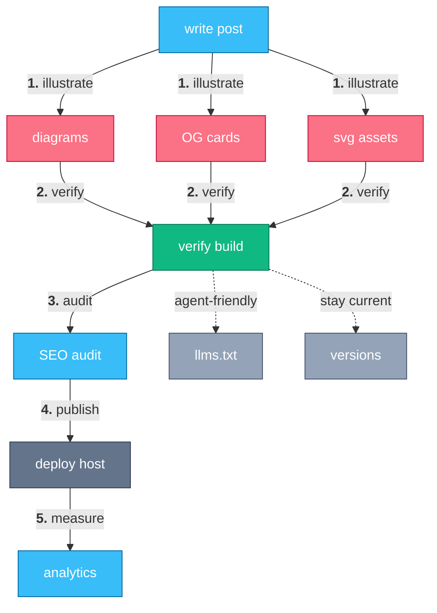

# Agent-Maintained Hugo Site

> Write, illustrate, verify, optimize, and measure a Hugo blog with an agent.

Running a Hugo blog well means doing the same nine things for every post, and doing them the same way every time.
This suite chains an agent through the full loop: draft the post, add readable inline diagrams, generate branded OG/social cards, keep SVG assets small, verify the build the way the deploy host actually runs it, audit the built output for SEO and UX issues before it ships, and pull a GA4 + Search Console report afterward to see what to write next.
Two more skills run in the background rather than per-post: keeping the site agent-friendly with `llms.txt` and markdown twins, and keeping Hugo, Go, and the theme module pinned and current.

Nothing here is Hugo-magic — every skill drives ordinary CLI tools (`hugo`, `svgo`, `go`) and reads/writes plain files in the repo, so the loop stays inspectable and git-diffable at every step.

## How it works



A post fans out into its assets (diagrams, OG cards, SVGs), everything funnels back through the build verification checkpoint, then on to an audit and the actual deploy, with analytics closing the loop on what to write next.
The two maintenance skills — `llms.txt` generation and version bumps — run off-cycle, not per-post, which is why they hang off the checkpoint as dotted lines rather than sitting in the main chain.

## A week with it

Each step is the literal phrase you say to your agent (Claude Code, pi, or any harness that reads skills):

1. **"write a blog post"** — draft a new post: front matter, file layout, and the featured-image-to-card flow (`write-hugo-blog-post`).
2. **"add a diagram"** — add a mermaid diagram that actually renders readably in the content column (`author-mermaid-diagram`).
3. **"make an OG image"** — generate a branded 1200x630 social-share card for the post (`generate-og-images`).
4. **"optimize svg"** — shrink any SVG assets the post pulled in, keeping the smaller result only if it actually shrank (`optimize-svg`).
5. **"make the site agent-friendly"** — refresh `/llms.txt`, `/llms-full.txt`, and per-page markdown twins from current content (`add-llms-txt`).
6. **"does it build"** — build the site the way the deploy host runs it, not the shortcut that hides PostCSS failures (`verify-hugo-build`).
7. **"audit the site"** — crawl the built output for missing titles, meta descriptions, alt text, and thin or orphan pages (`audit-static-site`).
8. **"analytics report"** — pull a dated GA4 + Search Console summary of top pages, queries, and near-miss positions (`report-site-analytics`).
9. **"update go version"** — bump Hugo, Go, or the theme module and keep every pinned version in sync across `go.mod` and the deploy config (`bump-hugo-versions`).

<!-- suite-skills:begin -->
## Skills in this suite

| Skill | Purpose |
|-------|---------|
| [`write-hugo-blog-post`](../../skills/write-hugo-blog-post/SKILL.md) | Use when authoring or editing a blog post in a Hugo site (any theme) — triggers "write a blog post", "publish a tutorial", "add a post". |
| [`author-mermaid-diagram`](../../skills/author-mermaid-diagram/SKILL.md) | Use when adding or fixing a mermaid diagram in a Hugo (or other static-site) page so it renders readably inline in a narrow content column (triggers "add a d... |
| [`generate-og-images`](../../skills/generate-og-images/SKILL.md) | Use to generate branded 1200x630 social-share (OG/Twitter) card images for a site's pages, with title/tags/brand overlaid by Pillow over an AI, image, or gra... |
| [`optimize-svg`](../../skills/optimize-svg/SKILL.md) | Use when adding or committing an SVG asset (logos, icons) to keep it small — triggers "add this logo", "optimize svg", "svg is too big". |
| [`add-llms-txt`](../../skills/add-llms-txt/SKILL.md) | Use to add LLM-friendly outputs to a Hugo site — /llms.txt and /llms-full.txt indexes plus a per-page markdown twin at <url>/index.md — generated from conten... |
| [`verify-hugo-build`](../../skills/verify-hugo-build/SKILL.md) | Use when verifying a Hugo site build before declaring it done or pushing (triggers "does it build", "verify the site", after editing layouts/SCSS/content). |
| [`audit-static-site`](../../skills/audit-static-site/SKILL.md) | Use to crawl a built static-site output dir and flag SEO/UX issues (titles, meta descriptions, alt text, thin/orphan/duplicate pages) before publishing. |
| [`report-site-analytics`](../../skills/report-site-analytics/SKILL.md) | Use to pull a GA4 + Google Search Console report (top pages, queries, CTR, near-miss positions) into a dated markdown/JSON summary for an SEO/reachability pass. |
| [`bump-hugo-versions`](../../skills/bump-hugo-versions/SKILL.md) | Use when bumping Hugo, Go, or a theme loaded as a Hugo Module via go.mod, with versions pinned in a deploy config (netlify.toml or a GitHub Actions workflow). |

## Install

With the [skills.sh](https://www.skills.sh/) CLI (needs Node.js):

```bash
npx skills add sanketsudake/harness-configs \
  --skill write-hugo-blog-post \
  --skill author-mermaid-diagram \
  --skill generate-og-images \
  --skill optimize-svg \
  --skill add-llms-txt \
  --skill verify-hugo-build \
  --skill audit-static-site \
  --skill report-site-analytics \
  --skill bump-hugo-versions \
  -y
```
<!-- suite-skills:end -->

## Getting started

1. Install the skills (block above).
2. Have a Hugo site checked out with the theme wired up as a Hugo Module (`go.mod`), and the target Hugo version pinned somewhere in your deploy config (e.g. `HUGO_VERSION` in `netlify.toml` or a GitHub Actions workflow) — `verify-hugo-build` and `bump-hugo-versions` both key off that pin.
3. Make sure the local toolchain matches: the `hugo` binary the deploy config pins, a Go toolchain for module bumps, and Node/`npx` for `svgo`.
4. For `report-site-analytics`, set up Application Default Credentials plus `GA4_PROPERTY_ID` and `GSC_SITE_URL` for the site you want reported on.
5. Say **"write a blog post"** to start the loop, or jump straight to any single skill above — none of them require the others to run first.

---

Part of [harness-configs](../../README.md); browse all skills in the [catalog](../../skills/README.md).
