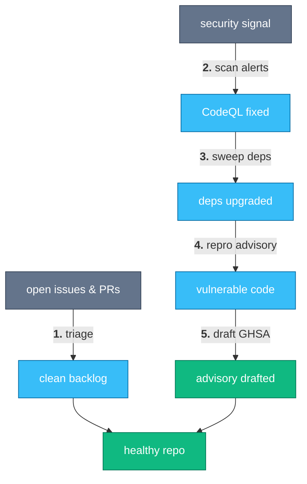

# OSS Maintainer Copilot

> Backlog triage, CodeQL remediation, and security advisories for repos you maintain.

Maintaining an open-source repo means two kinds of unglamorous work: the noisy backlog nobody has time to scrub, and the security signal that shows up whether you're ready for it or not.
This suite hands both to an agent.
On the backlog side, it goes through open issues and PRs like a product manager — closing stale, duplicate, and already-shipped items, and categorizing whatever is left by type, area, and priority.
On the security side, it works code-scanning alerts down to a taint source and fixes or dismisses them, runs dependency upgrades in small bisectable groups instead of one giant bump, reproduces the exact vulnerable code behind an advisory that affects one of your dependencies, and — when the vulnerability lives in your own repo — drafts the GHSA/CVE content for you to review and publish.

Nothing here writes to GitHub without a review step in between; every stage is designed to be re-run safely.

## How it works



Backlog noise and security signal are two independent entry points; both eventually resolve into the same healthy-repo state, whether that means a closed issue, a fixed alert, an upgraded dependency, or a published advisory.

## A week with it

Each step is the literal phrase you say to your agent (Claude Code, pi, or any harness that reads skills):

1. **"go through all open issues and PRs and see what can be closed"** — scrub the backlog: close stale/duplicate/shipped items, categorize the rest (`triage-gh-backlog`).
2. **"check code-scanning alerts"** — list open CodeQL alerts, trace each to its taint source, fix the real ones, dismiss the false positives, and verify on the PR merge ref (`remediate-codeql-alerts`).
3. **"run a dep security pass"** — upgrade outdated/vulnerable Go dependencies in lockstep groups, one commit per group, so a regression bisects cleanly (`go-deps-security-sweep`).
4. **"pull the vulnerable source for this advisory"** — resolve a GHSA/CVE to its repo and version range, then shallow-clone the last vulnerable tag so you can inspect or reproduce the bug locally (`source-code-for-gh-advisory`).
5. **"draft the advisory"** — when the vulnerability is in your own repo, triage existing advisories and produce paste-ready GHSA form content (CVE request and publish stay UI actions for you to click) (`author-security-advisory`).

<!-- suite-skills:begin -->
## Skills in this suite

| Skill | Purpose |
|-------|---------|
| [`triage-gh-backlog`](../../skills/triage-gh-backlog/SKILL.md) | Use when scrubbing or triaging a GitHub repo's open issue/PR backlog — e.g. "go through all open issues and PRs and see what can be closed", "scrub the outst... |
| [`remediate-codeql-alerts`](../../skills/remediate-codeql-alerts/SKILL.md) | Use when fixing or triaging GitHub code-scanning / CodeQL alerts (triggers "fix codeql issues", "check code-scanning alerts", "dismiss false-positive alert"). |
| [`go-deps-security-sweep`](../../skills/go-deps-security-sweep/SKILL.md) | Run a grouped, bisectable Go dependency security sweep. |
| [`source-code-for-gh-advisory`](../../skills/source-code-for-gh-advisory/SKILL.md) | Use when the user wants to obtain, inspect, or reproduce the vulnerable source code referenced by a GitHub Security Advisory (GHSA-xxxx / CVE) — including se... |
| [`author-security-advisory`](../../skills/author-security-advisory/SKILL.md) | Use when triaging or preparing a GitHub repository security advisory as a maintainer (triggers "draft the advisory", "prepare GHSA content", "request CVE", "... |

## Install

With the [skills.sh](https://www.skills.sh/) CLI (needs Node.js):

```bash
npx skills add sanketsudake/harness-configs \
  --skill triage-gh-backlog \
  --skill remediate-codeql-alerts \
  --skill go-deps-security-sweep \
  --skill source-code-for-gh-advisory \
  --skill author-security-advisory \
  -y
```
<!-- suite-skills:end -->

## Getting started

1. Install the skills (block above).
2. Make sure `gh` is authenticated with the `security_events` scope for the CodeQL and advisory skills (`gh auth refresh -s security_events`).
3. For the backlog skill, install `gitcrawl` (`brew install openclaw/tap/gitcrawl && gitcrawl init`) so triage runs against a local mirror instead of burning API quota.
4. For the dependency sweep, make sure a Go toolchain is on `PATH`; the skill installs `govulncheck` itself on first run.
5. Point each skill at your repo with `--repo owner/name` (or the equivalent prompt) and start with the backlog or a specific advisory, whichever is noisier this week.

---

Part of [harness-configs](../../README.md); browse all skills in the [catalog](../../skills/README.md).
