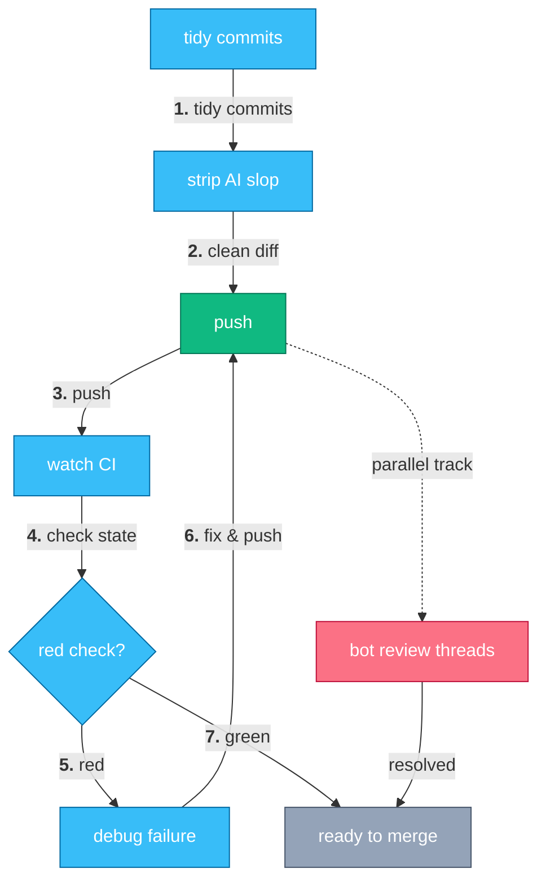

# PR Shepherding

> Get a pull request from pushed to merged: clean diff, green CI, resolved reviews.

There's a loop every PR goes through between "I pushed" and "it merged," and most of it is busywork an agent can carry for you.
This suite covers that loop end to end: make the PR easy to review before anyone looks at it, strip out AI-generated slop from the diff, watch CI to a terminal state instead of polling `gh pr checks` in a loop, triage a red check to the failing line cheaply, and clear bot review threads so the PR stays at a mergeable baseline.
Push once, then let the agent shepherd it — fixing what's red, resolving what's flagged, and re-requesting review — until it's ready to merge.

## How it works



Before the first push, the diff gets tidied and de-slopped.
After that, `push` is the hub: it kicks off CI watching and, in parallel, bot review-thread resolution.
A red check sends you to `debug-ci` and back to `push`; a green check plus resolved threads is what "ready to merge" means.

## A week with it

Each step is the literal phrase you say to your agent (Claude Code, pi, or any harness that reads skills):

1. **"make this easy to review"** — clean up noisy commit history, tighten the PR description, and add reviewer guidance without touching behavior (`make-pr-easy-to-review`).
2. **"deslop this diff"** — remove AI-generated code slop and style noise from the branch before anyone reviews it (`deslop`).
3. **"resolve copilot comments"** — fix what a bot reviewer flagged, mark the threads resolved, and re-request review (`resolve-bot-review-threads`).
4. **"watch CI"** — arm a background watch on the PR's checks and get notified the moment one goes green or red, instead of polling (`watch-ci`).
5. **"why is this failing in CI"** — triage a red check to the failing line, cheapest log fetch first, separating real regressions from pre-existing noise (`debug-ci`).

<!-- suite-skills:begin -->
## Skills in this suite

| Skill | Purpose |
|-------|---------|
| [`make-pr-easy-to-review`](../../skills/make-pr-easy-to-review/SKILL.md) | Prepare PRs for review by cleaning noisy history, improving PR descriptions, and adding reviewer guidance without changing code behavior. |
| [`deslop`](../../skills/deslop/SKILL.md) | Remove AI-generated code slop and clean up code style |
| [`resolve-bot-review-threads`](../../skills/resolve-bot-review-threads/SKILL.md) | Use when a PR has bot/Copilot review comments to clear — fix them, mark the threads resolved, and re-request the bot until the PR is at a good base (triggers... |
| [`watch-ci`](../../skills/watch-ci/SKILL.md) | After pushing to a PR, watch its CI checks to terminal state and surface each transition as a notification instead of busy-polling. |
| [`debug-ci`](../../skills/debug-ci/SKILL.md) | Triage and root-cause a failing GitHub Actions CI run on a PR efficiently. |

## Install

With the [skills.sh](https://www.skills.sh/) CLI (needs Node.js):

```bash
npx skills add sanketsudake/harness-configs \
  --skill make-pr-easy-to-review \
  --skill deslop \
  --skill resolve-bot-review-threads \
  --skill watch-ci \
  --skill debug-ci \
  -y
```
<!-- suite-skills:end -->

## Getting started

1. Install the skills (block above).
2. Make sure `gh auth status` shows a token with `repo` scope — `resolve-bot-review-threads` needs the GraphQL API to resolve threads and re-request bot reviewers, and `watch-ci` / `debug-ci` both shell out to `gh pr checks` / `gh run view`.
3. Push a branch, open the PR, and say **"make this easy to review"** to kick off the loop; from there, watch and debug take over until it's green.

---

Part of [harness-configs](../../README.md); browse all skills in the [catalog](../../skills/README.md).
