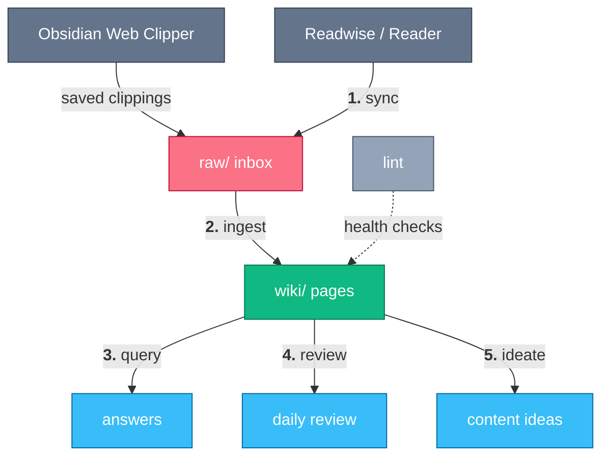

# Second Brain

> An Obsidian knowledge base your agent maintains for you.

You clip articles, highlight books, save links — and never look at them again.
This suite turns that pile into a living wiki: an agent ingests what you save, connects it to what you already know, answers questions from it, resurfaces it on a schedule, and mines it for things worth writing.

Everything lives in a plain Obsidian vault — markdown files you own, readable with or without any of this tooling.

## How it works



Sources flow into a `raw/` inbox, ingestion turns them into interlinked wiki pages, and everything downstream — questions, reviews, content ideas — works off the wiki.

## A week with it

Each step is the literal phrase you say to your agent (Claude Code, pi, or any harness that reads skills):

1. **"sync readwise"** — pull new Readwise / Reader highlights into `raw/`, deduplicated and metadata-enriched (`readwise-second-brain-sync`).
2. **"I clipped some articles"** — sweep Obsidian Web Clipper output into `raw/` and process everything there into wiki pages, cross-linked to pages you already have (`second-brain-ingest`).
3. **"what do I know about vector databases?"** — answer from *your* wiki, citing your pages, not the open web (`second-brain-query`).
4. **"daily review"** — resurface highlights, concepts, and stale pages, spaced-repetition style (`second-brain-review`).
5. **"ideate"** — mine the wiki for defensible blog-post and talk ideas, kept in a scored backlog (`second-brain-ideate`).
6. **"health check"** — find contradictions, orphan pages, and missing cross-links (`second-brain-lint`).

<!-- suite-skills:begin -->
## Skills in this suite

| Skill | Purpose |
|-------|---------|
| [`second-brain`](../../skills/second-brain/SKILL.md) | Set up a new Obsidian knowledge base with the LLM Wiki pattern. |
| [`readwise-second-brain-sync`](../../skills/readwise-second-brain-sync/SKILL.md) | Sync Readwise highlights and Reader documents into the second-brain vault's raw/ folder in Obsidian-Web-Clipper format. |
| [`second-brain-ingest`](../../skills/second-brain-ingest/SKILL.md) | Process raw source documents into wiki pages. |
| [`second-brain-query`](../../skills/second-brain-query/SKILL.md) | Answer questions against the knowledge base wiki. |
| [`second-brain-review`](../../skills/second-brain-review/SKILL.md) | Resurface knowledge from the second-brain wiki — a daily/periodic review of highlights, concepts, and stale pages, replacing Readwise's daily review. |
| [`second-brain-ideate`](../../skills/second-brain-ideate/SKILL.md) | Mine the knowledge-base wiki for strong, defensible content ideas — blog posts, conference talks, internal sessions, threads. |
| [`second-brain-lint`](../../skills/second-brain-lint/SKILL.md) | Health-check the wiki for contradictions, orphan pages, stale claims, and missing cross-references. |

## Install

With the [skills.sh](https://www.skills.sh/) CLI (needs Node.js):

```bash
npx skills add sanketsudake/harness-configs \
  --skill second-brain \
  --skill readwise-second-brain-sync \
  --skill second-brain-ingest \
  --skill second-brain-query \
  --skill second-brain-review \
  --skill second-brain-ideate \
  --skill second-brain-lint \
  -y
```
<!-- suite-skills:end -->

## Getting started

1. Install the skills (block above).
2. Open your agent in an empty folder (or an existing vault) and say **"onboard"** — the `second-brain` skill walks you through a setup wizard: vault name, location, knowledge domains, tooling.
3. Start clipping and highlighting; say **"ingest"** whenever the inbox has new material.

Optional companion: if you use Readwise, also install [`readwise-cli`](../../skills/readwise-cli/SKILL.md) — the sync skill drives it.

---

Part of [harness-configs](../../README.md); browse all skills in the [catalog](../../skills/README.md).
